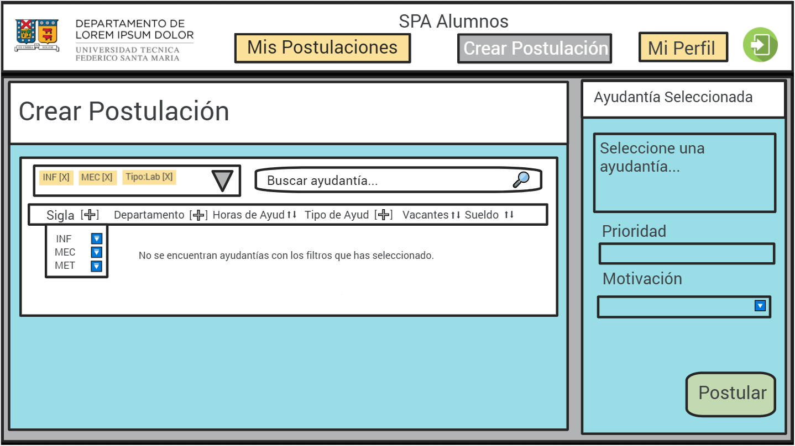

# Entrega 2 - INF-322

## Informe Testing con Usuarios

### Introducción

Se realizaron pruebas de funcionalidad a un prototipo con un usuario perteneciente al grupo target para nuestro proyecto, es decir, un estudiante de la universidad que usa el _SPA_ actual. Se le presentó nuestro _mock-up_ de baja fidelidad (prototipo) del nuevo _SPA_, el cual fue desarrollado principalmente en [_Google JamBoard_](https://jamboard.google.com/d/1SR3N5V2sgNoGz49jrmlWJ8i5pyWl8ZvTYXfgFCej4Po/edit?usp=sharing). La interacción completa fue grabada y a través del _feedback_ obtenido de parte del usuario se le realizaron mejoras al modelo actual.

### Tareas Evaluadas

Se le entregó al usuario 2 tareas a realizar:

1. Encontrar las ayudantías a las cuales había postulado
2. Intentar inscribirse como ayudante a un curso arbitrario

Estas funcionalidades fueron simuladas con interacciones y respuestas manuales mientras toda la interacción era grabada.

### Problemas Encontrados

Los principales problemas encontrados por el usuario en nuestro _mock-up_ inicial fueron:

* Confusión del concepto de **_"prioridad"_**: este campo está presente en la vista 6, en la cual se pueden crear nuevas postulaciones a ayudantías. Este campo representa la prioridad con la cual escogemos una postulación sobre otra para el sistema, sin embargo esta fue entendida como la conocida _"prioridad académica"_ presente en nuestra universidad.
* Dificultad para rellenar el campo **_"motivación"_**: este campo está presente en la vista 6, en la cual se crean postulaciones y su información es requerida para poder crear esta postulación. El problema surgía debido a que el usuario no sabía cómo responder, ya que se presenta como un _"free-text box"_, dando bastante libertad al usuario para ello.

### Video del Testing

La grabación del proceso de _testing_ con un usuario se encuentra en el siguiente link de [_Google Drive_](https://drive.google.com/drive/folders/1J0A4q0zhJLiDviDNHTVCkvjt8d8hkreP?usp=sharing).

### Iteración y Mejoras

Luego de recibir el feedback de parte del usuario, se arreglaron distintos problemas, además de realizarse cambios menores de colores y de diseño no estructural. Las mejoras fueron:

1. Cambiar el campo de _"prioridad"_ a **_"prioridad postulación"_** para evitar confusiones.
2. Añadir un **_"drop-down menu"_** en el campo de _"motivación"_ con valores pre-fijados por nosotros, pensando en las motivaciones más comunes de un estudiante. Estas se asemejan bastante a las opciones ya presentes en el _SPA_ actual.

Finalmente, se mejoró el aspecto visual completo al re-hacer todo el _mock-up_ en _Adobe XD_, pasando entonces a ser un diseño de alta fidelidad. Las imágenes de las vistas que conforman el _mock-up_ más reciente se encuentran en el repositorio de GitHub.

