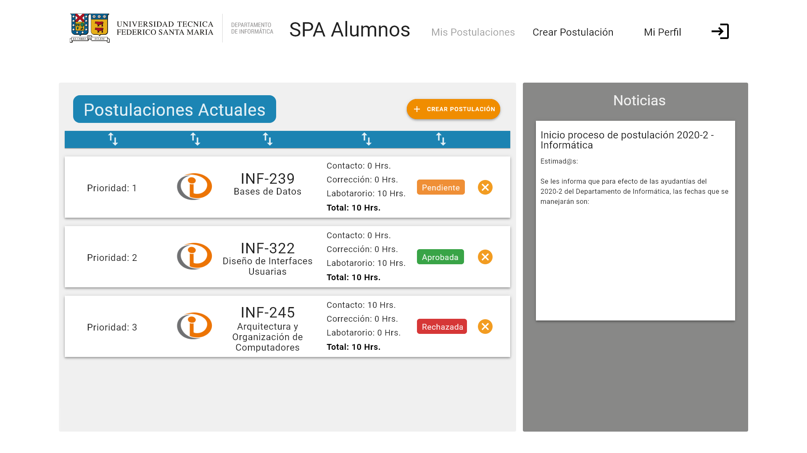

# Informe Entrega 4 - SPA Alumnos

INF-322 - Diseño de Interfaces Usuarias

* Diego Altamirano
* Pablo Aravena
* Javier Mendoza

## Descripción del Proyecto

El Sistema de Postulación a Ayudantías (SPA) es una plataforma utilizada por el Departamento de Informática para gestionar la postulación de estudiantes a distintos tipos de ayudantías que ofrece el Departamento. A través de esta plataforma se puede gestionar de forma cómoda las distintas postulaciones que tiene un alumno al principio del semestre a distintas ayudantías, mientras que un profesor puede gestionar y seleccionar a qué alumnos seleccionará como ayudantes para asignaturas, laboratorios o como ayudantes administrativos.

La plataforma tiene dos vistas principales:

* Vista de Estudiantes: La vista por la cual el estudiante puede ingresar su información académica relevante para el proceso de selección; explorar las ayudantías a las que puede postular, junto con sus requisitos de tiempo, la remuneración asociada y otra información relevante; postular a distintas ayudantías, tanto de cátedra, como de laboratorio y administrativas; y posteriormente poder hacer un seguimiento de sus postulaciones, para revisar cuáles de ellas fueron aceptadas.

* Vista de Profesores: La vista por la cual el profesor puede gestionar información respecto a las asignaturas y laboratorios que tiene a cargo, además de seleccionar, entre las distintas postulaciones, a los futuros ayudantes para el semestre académico, tanto en asignaturas, laboratorios y tareas administrativas.

A inicio de este año, esta plataforma fue modernizada en un proceso que incluye una actualización de las interfaces de la página web. Sin embargo, las interfaces propuestas presentan bastantes falencias, dificultando el proceso de postulación y selección de asignaturas. En este proyecto, se generará una propuesta de nuevas interfaces, enfocándose en las vistas que utiliza el alumno, utilizando principios de diseño de interfaces y utilizanco el proceso Lean UX.

## Persona

* **Persona**: Alumna/o de la UTFSM
* **Demografía**:
    * Alumna/o universitario.
    * Conoce bastante sobre redes sociales (las usa a diario).
    * Posee bajos fondos monetarios.
    * Entre 18 a 27 años.
    * Manejo relativamente decente de la tecnología.

* **Comportamiento**:
    * Quiere ser ayudante de algún ramo.
    * Tiene muchas cosas que hacer y ramos por los que estudiar.
    * Evita involucrarse mentalmente con textos de más de 5 párrafos.
    * No le teme a navegar sitios web desde el celular.

* **Necesidades, obstáculos y deseos**:
    * Quiere postularse como ayudante rápidamente. Su tiempo es valioso.
    * No entiende cómo postular a un curso.
    * Quiere tener mayor poder monetario.
    * No sabe cómo buscar cursos.
    * Quiere adquirir mayor experiencia en su área laboral a través de ayudantías.

## Hipótesis

A partir de la definición y análisis de las Personas, se desprenden las siguientes hipótesis respecto al proyecto:

* Creemos que lograremos obtener más departamentos de carrera involucradas usando el portal si un alumno puede lograr postular a ayudantías rápidamente con una interfaz más intuitiva para elegir las ayudantías a las cuales postular.
* Creemos que lograremos obtener más usuarios que a futuro quieren postular si un alumno puede lograr observar características generales de cada ramo, como sus pagas, cantidad de postulaciones, etc, mediante una función para ver los datos relacionados a sueldos, frecuencia de postulación y ayudantes aceptados por ramo.
* Creemos que lograremos mantener usuarios frecuentes luego de las postulaciones si un alumno puede lograr seguir viendo ramos una vez terminado el proceso de postulación, mediante una función para ver todos los ramos y sus cargos de ayudante después de haber pasado la fecha de inscripciones.
* **Hipótesis 4**
* **Hipótesis 5 (tienen que ser 4 ó 5)**

## Prototipo

Para las vistas de alumnos, se desprenden las siguientes sub-vistas relacionadas a la funcionalidad para ver las ayudantías a las que se ha postulado, además de la funcionalidad para postular como ayudante a un curso arbitrario.

### Vista Mis Postulaciones

Corresponde a la landing-page del sitio, es decir, la primera cosa que ven los estudiantes al ingresar con su cuenta, de manera de llegar rápidamente a lo más importante de la página. Este posee un *navbar* con las principales funcionalidades.

##### Postulaciones Actuales

Consiste en una vista de las postulaciones actuales del alumno en cuestión, con los campos de:
* **Prioridad de Postulación**: en caso de que se quede en más de una ayudantía y el sobrecupo de horas haya sido rebasado.
* **Logo Departamental**: de manera de facilitar a la vista el saber a qué departamento pertenece la postulación.
* **Sigla y Nombre del Ramo**: para conocer de manera exacta el código identificador del ramo, además de su nombre completo.
* **Horas de Trabajo**: de manera de tener en cuenta la cantidad de horas a dedicar para cada sub-tarea dentro del ramo, además del total de horas en que consiste la ayudantía.
* **Estado**: consiste en el estado actual de la postulación, si ha sido *rechazada*, *aprobada* o en su defecto, no ha sido procesada por un profesor todavía (*pendiente*).

Además de estos campos, se posee un botón para cancelar una postulación en cualquier momento, el cual pediría una confirmación antes de realizar esta operación, así como también otro botón para crear una postulación que nos redirige a la vista de "*Crear Postulación*". Se permite el re-ordenamiento de las postulaciones mostradas según los campos mencionados previamente.

##### Noticias

Consiste en un feed, el que usa una pequeña parte del landing-site para poder ver las noticias respecto a las ayudantías y postulaciones en general, de manera que estas sean parte de las primeras cosas a ver, y que no sean ignoradas por los usuarios al ser dejadas en una vista propia.

### Vista Crear Postulación

Consiste en la vista que contiene todo lo relacionado a la postulación e información de una ayudantía para un ramo arbitrario. Posee el mismo _navbar_ que la vista anterior.

##### Crear Postulación

Posee una barra de búsqueda según _keywords_ dadas relacionadas al nombre completo o siglas de un ramo, además de filtros de búsqueda según **ramo** y **tipo de ayudantía** (de laboratorio, corrección o contacto). Las ayudantías a mostrar pueden ser re-ordenadas según distintos criterios basados en los siguientes campos:
* **Sigla**: código identificador del ramo. Pueden ordenarse arbitrariamente según las posiciones dadas de los ramos en el _dropdown_ con el botón **+**.
* **Departamento**: departamento al cual pertenece. Pueden ordenarse arbitrariamente según las posiciones dadas de los departamentos en el _dropdown_ con el botón **+**.
* **Horas de Ayudantía**: el total de horas a trabajar semanalmente con esta ayudantía. Puede ordenarse de mayor a menor según las horas.
* **Tipo de Ayudantía**: el tipo de ayudantía en que consiste esta (). Pueden ordenarse arbitrariamente según la posición dada de los tipos con el botón **+**.
* **Vacantes**: el número de vacantes disponibles para la ayudantía a postular. Puede ordenarse de menor a mayor según este atributo.
* **Sueldo**: el total a pagar de manera mensual por esta ayudantía. Puede ordenarse de menor a mayor según este atributo.

##### Ayudantía Seleccionada
Consiste en un frame que contiene información de la ayudantía seleccionada (nombre completo del ramo, tipo y cantidad de horas de la ayudantía y sueldo) en la caja de texto más grande, además de una barra de texto para ingresar la prioridad de postulación respecto a las otras postulaciones y un menú de _dropdown_ para seleccionar una de las motivaciones pre-definidas. Luego de tener estos 2 inputs (prioridad y motivación) listos, se puede presianar el botón "**Crear Postulación**" para que esta se realice.

## Resultado de Test del Prototipo

#### Test Prototipo de Baja Fidelidad
Se realizaron pruebas de funcionalidad a un prototipo de baja fidelidad y con un usuario perteneciente al grupo target para nuestro proyecto, es decir, un estudiante de la universidad que usa el _SPA_ actual.

Se le entregó al usuario 2 tareas a realizar:

1. Encontrar las ayudantías a las cuales había postulado
2. Intentar inscribirse como ayudante a un curso arbitrario

Los principales problemas encontrados por el usuario en nuestro _mock-up_ inicial fueron:

* Confusión del concepto de **_"prioridad"_**: este campo está presente en la vista 6, en la cual se pueden crear nuevas postulaciones a ayudantías. Este campo representa la prioridad con la cual escogemos una postulación sobre otra para el sistema, sin embargo esta fue entendida como la conocida _"prioridad académica"_ presente en nuestra universidad.
* Dificultad para rellenar el campo **_"motivación"_**: este campo está presente en la vista 6, en la cual se crean postulaciones y su información es requerida para poder crear esta postulación. El problema surgía debido a que el usuario no sabía cómo responder, ya que se presenta como un _"free-text box"_, dando bastante libertad al usuario para ello.

Luego de recibir el feedback de parte del usuario, se arreglaron distintos problemas, además de realizarse cambios menores de colores y de diseño no estructural. Las mejoras fueron:

1. Cambiar el campo de _"prioridad"_ a **_"prioridad postulación"_** para evitar confusiones.
2. Añadir un **_"drop-down menu"_** en el campo de _"motivación"_ con valores pre-fijados por nosotros, pensando en las motivaciones más comunes de un estudiante. Estas se asemejan bastante a las opciones ya presentes en el _SPA_ actual.

Finalmente, se mejoró el aspecto visual completo al re-hacer todo el _mock-up_ en _Adobe XD_, pasando entonces a ser un diseño de alta fidelidad.

#### Test Prototipo de Alta Fidelidad

Se realizaron pruebas de funcionalidad al prototipo de alta fidelidad y con un usuario perteneciente al grupo target para nuestro proyecto, es decir, un estudiante de la universidad que usa el _SPA_ actual, el cual además pertenece a otro grupo de desarrollo basado en Lean UX. Se pidió realizar las mismas tareas previamente realizadas.

En nuestros testeos, la ejecución de las tareas se realizó sin problemas, demostrando que la interfaz cumplía su propósito.

Un pequeño _feedback_ que recibimos fue respecto al mensaje posterior a contactarse con un profesor, en concreto, que se comunique mejor cuando el mensaje fue enviado con éxito

Concluímos del análisis de estos _tests_ que la hipótesis 1 es acertada, pues los alumnos aprecian bastante la facilidad de postulación y búsqueda de ayudantías, además de tomar menos tiempo para las tareas que en la versión original del _SPA Alumnos_, por lo que es bastante factible que su uso escale a más departamentos de carrera.
