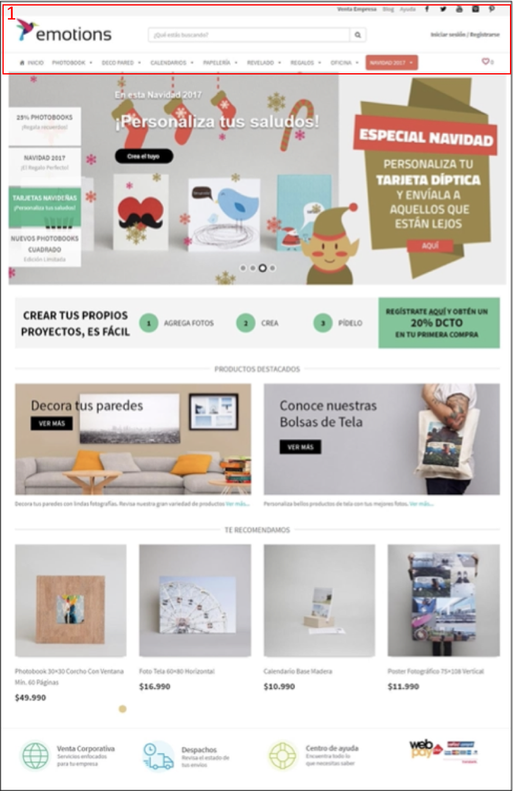
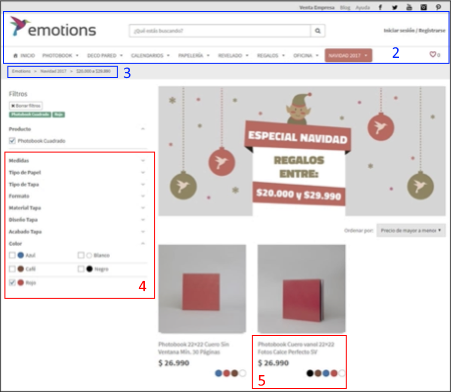
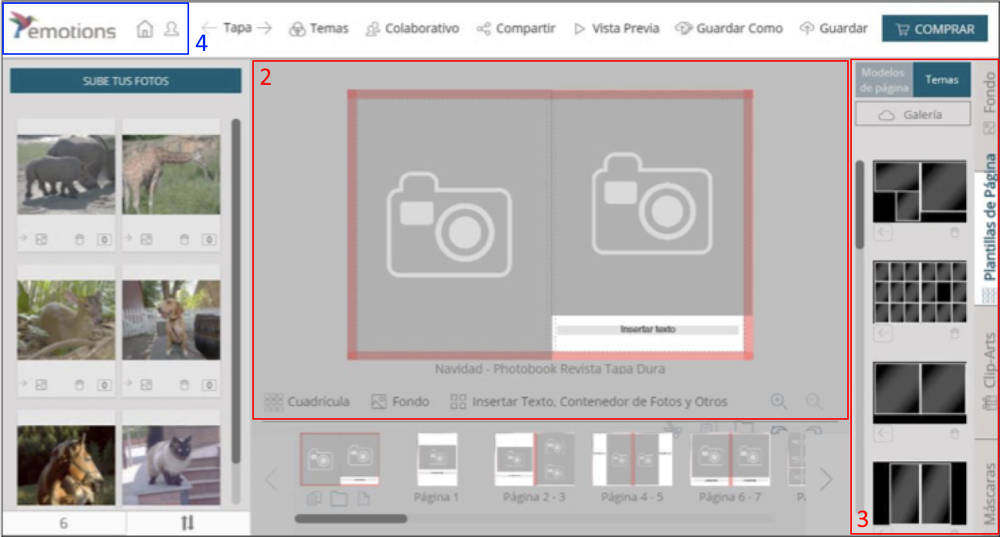
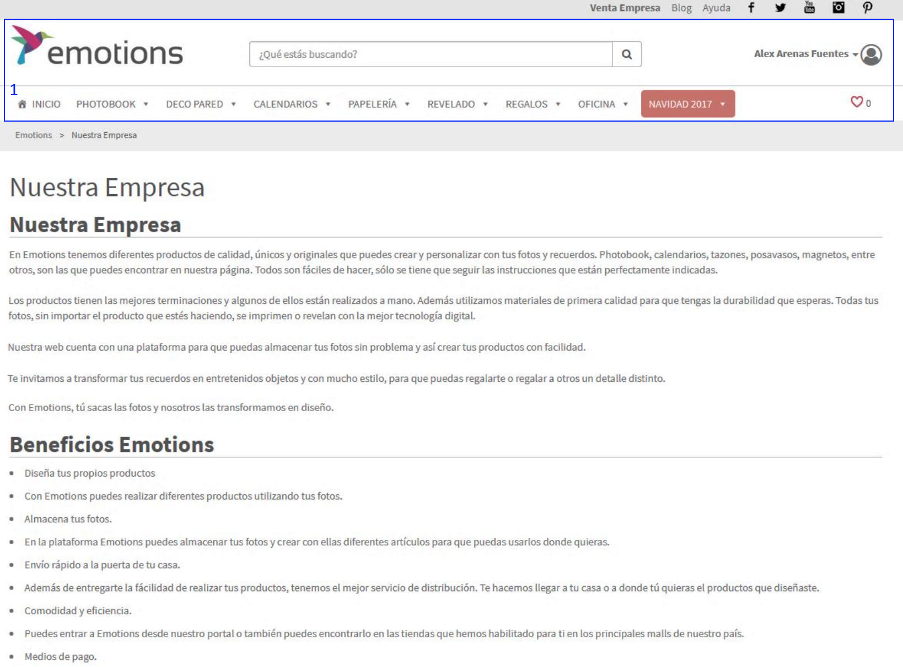

# Entrega 5 - Emotions CL

---

## Parte 1

A continuación, las imágenes provistas muestran los patrones de navegación y organización del espacio identificados. Los elementos que se repiten en todas las imágenes sólo se resaltan una vez, para simplificar.

* **Patrones de Organización del Espacio (en Rojo)**
  1. **Marco Visual:** Todas las páginas presentadas mantienen un marco visual similar, presentando el logo de la compañía y un panel blanco de navegación.
  2. **Escenario Principal:** En la tercera imagen, al mostrar una interfaz para editar un álbum de fotos, se deja un escenario grande en gris para poder hacer la edición, junto con barras de herramientas a los lados y debajo del mismo (fotos, plantillas, navegación por páginas del álbum)
  3. **Pila de Naipes:** En la tercera imagen se puede ver que la barra de herramientas de la columna derecha presenta un conjunto de pestañas, las cuales ocultan otras opciones de edición del álbum a las que el usuario puede acceder.
  4. **Paneles Cerrables:** En la segunda imagen, para organizar los filtros de búsqueda se muestran paneles cerrables, los cuales dividen los filtros en distintas categorías, pudiendo ocultar los que no le interesan al usuario.
  5. **Balance Diagonal:** En la segunda imagen, los cuadros que muestran cada producto muestran el nombre y precio alineados en la esquina superior izquierda; y los colores disponibles en la esquina inferior derecha. Esto genera una sensación de completitud, haciendo claro dónde termina la tarjeta que describe el producto.
* **Patrones de Navegación (en Azul)**
  1. **Claros Puntos de Entrada:** En todas las Imágenes se ve claramente que el panel de navegación resalta los puntos de entrada: El logo de la compañía, el botón de inicio, el link al Perfil/Iniciar Sesión y la barra de búsqueda.
  2. **Navegación Global:** En todas las imágenes (a excepción de la tercera) se puede ver la barra de navegación global, que contiene links a las distintas páginas, incluyendo la página de Inicio.
  3. **Migas de Pan:** En la segunda y cuarta imagen se pueden ver migas de pan, que indican la secuencia de páginas visitadas para llegar a la actual.
  4. **Escotilla de Escape:** En la tercera imagen, que muestra la página para editar un álbum, se ve claramente que se puede escapar a la página principal o al perfil a través de los botones en la esquina superior derecha.

## Parte 2

### Críticas

#### Lo bueno

El sitio web en cuestión presenta bastantes de los aspectos recomendados para un sitio web chileno:

* Colocación del logo a la izquierda superior de la página
* Localización del botón y barra de búsqueda en la parte superior de la página
* Etiqueta del botón de búsqueda es una lupa
* Posee un menú de búsqueda simple
* Usa navegación por menú con _dropdown_
* Color de fondo blanco y texto negro o gris

#### Lo malo

Sin embargo, este sitio no muestra un botón de **"Quiénes Somos"** en el home mostrado al principio, aunque posea un apartado para ello tal como se muestra en la última imagen de **"Nuestra Empresa"**.

Además, la imagen que muestra un menú en un dispositivo móvil nos da a entender que no sigue un _"diseño líquido"_, sino solamente _"responsivo"_, ya que se muestran 2 columnas de imágenes casi pegadas unas con otras y de un tamaño bastante grande respecto al total de la pantalla. Dentro de la misma imagen, podemos notar también la falta de un menú de navegación a en la parte superior de la página (solo posee un botón para home y perfil de usuario).
