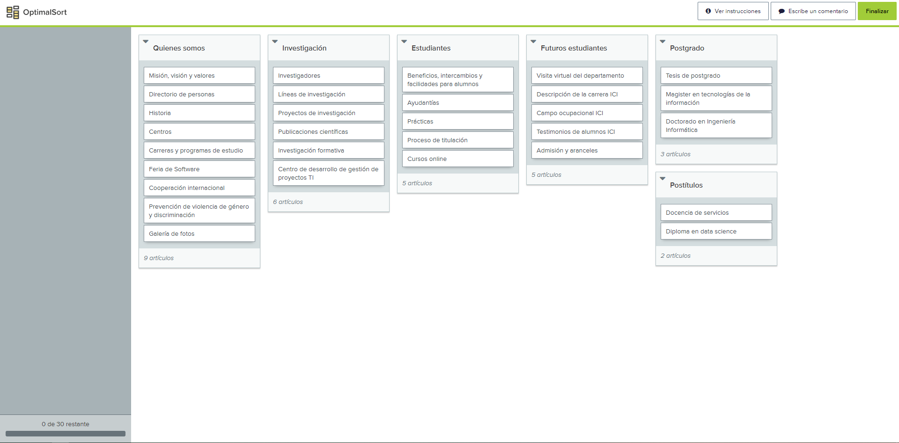

# Informe sobre Actividad de Card-Sorting

* Diego Altamirano
* Pablo Aravena
* Javier Mendoza

En la actividad de card-sorting, se utilizó la plataforma provista en aula para realizar el ejercicio. En general, se ordenaron las tarjetas considerando las categorías ya presentes en la plataforma, tratando de contestar a la pregunta *"Si necesito encontrar la información de la tarjeta X ¿En qué categoría la buscaría?"*.

De esta forma, la organización final de las tarjetas quedó de la siguiente manera:

